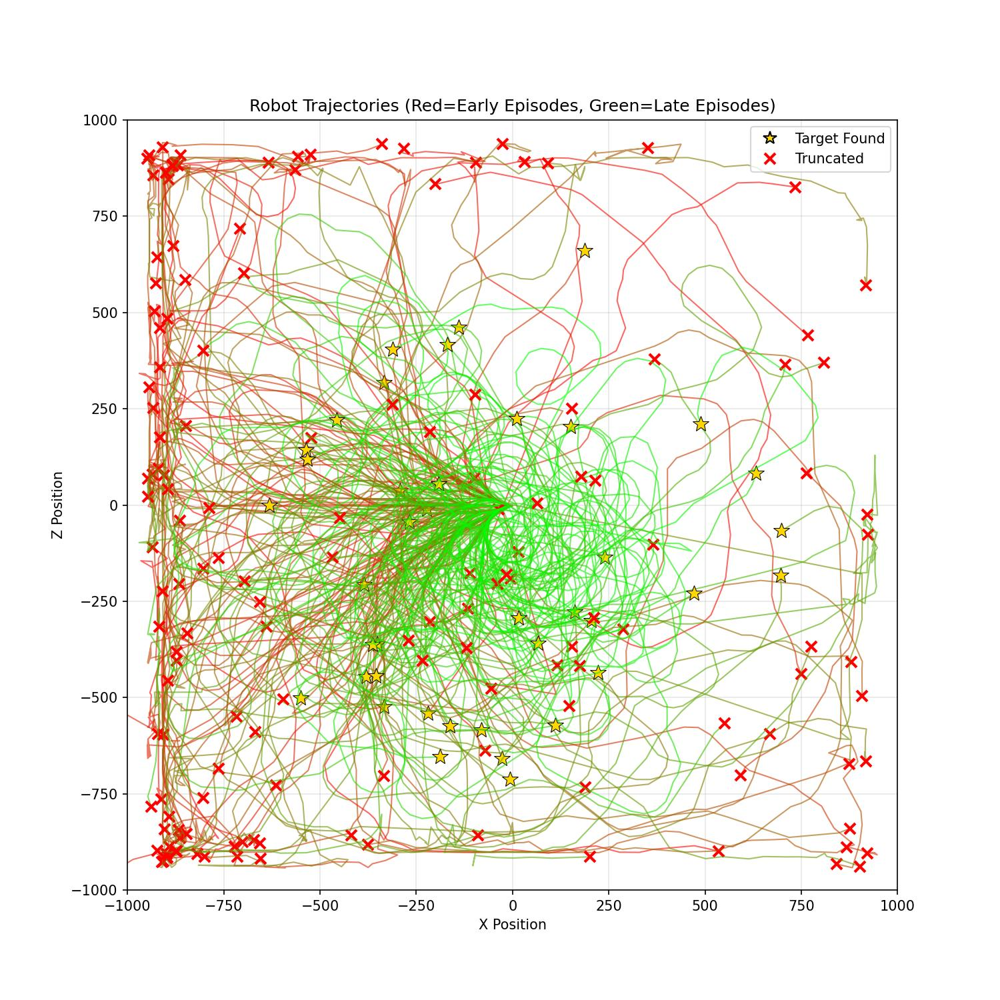

<style>
@media print {
  body {
    margin: 1cm 1.5cm;
    font-size: 10pt;
    line-height: 1.3;
  }
  h1 {
    font-size: 16pt;
    margin-top: 0.5cm;
    margin-bottom: 0.3cm;
  }
  h2 {
    font-size: 13pt;
    margin-top: 0.4cm;
    margin-bottom: 0.3cm;
  }
  h3 {
    font-size: 11pt;
    margin-top: 0.3cm;
    margin-bottom: 0.2cm;
  }
  p {
    margin-top: 0.2cm;
    margin-bottom: 0.2cm;
  }
  table {
    margin-top: 0.2cm;
    margin-bottom: 0.2cm;
  }
  img {
    margin-top: 0.1cm;
    margin-bottom: 0.1cm;
  }
  @page {
    size: A4;
    margin: 1cm 1.5cm;
  }
}
</style>

# PRÁCTICA 01: APRENDIZAJE POR REFUERZO
## Robótica Inteligente y Autónoma (RIA) - Curso 2025-2026

**Autores:**  
- Pablo Hernández Martínez (pablo.hernandez.martinez@udc.es)
- Iván Moure Pérez (i.moure@udc.es)

---

## 1. INTRODUCCIÓN Y METODOLOGÍA

### 1.1 Introducción

El presente trabajo aborda el problema de navegación autónoma de un robot móvil Robobo hacia un objetivo visual utilizando técnicas de Aprendizaje por Refuerzo (Reinforcement Learning, RL). El objetivo principal consiste en entrenar un agente inteligente capaz de controlar el robot para que alcance un cilindro de color rojo visible en su campo de visión, maximizando la tasa de éxito y minimizando el número de pasos necesarios.

El enfoque adoptado se basa en el algoritmo **Proximal Policy Optimization (PPO)**, implementado mediante la biblioteca Stable-Baselines3, y utiliza el simulador RoboboSim como entorno de entrenamiento y validación. La decisión de emplear PPO se fundamenta en sus propiedades de estabilidad durante el entrenamiento, su eficiencia en el uso de muestras y su menor sensibilidad a la elección de hiperparámetros en comparación con otros algoritmos de policy gradient como A2C o TRPO.

### 1.2 Diseño del Espacio de Observaciones

Una de las decisiones arquitectónicas más relevantes del proyecto fue la **discretización del espacio de observaciones**. En lugar de proporcionar al agente información continua sobre la posición exacta del objetivo en la imagen capturada por la cámara del robot, se optó por dividir el campo visual horizontal en **6 sectores discretos**:

- **Sectores 0-4:** El objetivo rojo es visible y se encuentra en diferentes regiones horizontales de la imagen (divididas en intervalos de 20 píxeles cada uno, desde posición X = 0 hasta X = 100).
- **Sector 5:** El objetivo no es visible en el campo de visión del robot.

Esta discretización se implementa mediante la siguiente lógica:

<div style="font-size: 10px;">

```python
sector = red_x // 20  # Para valores 0-99, cuando el objetivo no es visible sector=5
```

</div>

**Justificación de la discretización:**

La decisión de **discretizar el espacio de observaciones** en lugar de utilizar coordenadas continuas responde a una evaluación cuidadosa del balance entre la complejidad del problema y los recursos computacionales disponibles. Un espacio discreto de únicamente **6 valores** resulta considerablemente más manejable para el algoritmo PPO que un espacio continuo bidimensional, permitiendo que el agente explore el **espacio de estados** de forma más eficiente y alcance la **convergencia** en un número reducido de timesteps. Esta simplificación es particularmente valiosa cuando se trabaja con **recursos de entrenamiento limitados**, como es el caso de esta práctica.

Desde el punto de vista de la tarea específica, la navegación hacia el objetivo no requiere conocer con precisión milimétrica la posición exacta del cilindro, sino únicamente la **dirección general** hacia donde debe orientarse el robot. Los 6 sectores proporcionan esta **información direccional** de forma suficiente y eficaz, capturando la esencia del problema sin introducir complejidad innecesaria. Además, la discretización introduce una **tolerancia natural** que favorece la **generalización** del agente ante pequeñas variaciones en las condiciones iniciales del entorno, contribuyendo a políticas más robustas.

Los resultados experimentales validan esta elección de diseño: con solo **8192 timesteps** de entrenamiento se alcanza una convergencia satisfactoria y una **tasa de éxito del 100%** en validación. Este nivel de eficiencia habría sido considerablemente más difícil de lograr con observaciones continuas de mayor dimensionalidad, que habrían requerido tiempos de entrenamiento significativamente mayores. No obstante, es importante reconocer que esta simplificación conlleva un **trade-off**: la pérdida de información de posición precisa podría limitar la capacidad del agente para realizar maniobras muy finas en las proximidades inmediatas del objetivo, aunque esto no ha resultado ser un problema en la práctica para completar exitosamente la tarea.


### 1.3 Espacio de Acciones

El espacio de acciones del entorno es **discreto** con 3 acciones posibles. Cada acción controla las velocidades de las ruedas izquierda y derecha del robot (velocidades lineales en mm/s):

<table style="width:100%; border:none;">
<tr>
<td style="width:40%; vertical-align:top; border:none;">

| Acción | Símbolo | Descripción | Velocidad (izq, der) |
|--------|---------|-------------|----------------------|
| 0 | ↑ | Avanzar hacia adelante | (20, 20) |
| 1 | ← | Girar a la izquierda | (20, 0) |
| 2 | → | Girar a la derecha | (0, 20) |

</td>
<td style="width:60%; vertical-align:top; border:none; padding-left:20px;">

**Decisión de diseño importante:** Se consideró inicialmente incluir una cuarta acción para retroceder (↓), pero fue descartada intencionalmente. **Fomentar navegación forward-only** obliga al robot a moverse solo hacia adelante, forzando al agente a aprender estrategias de navegación directas y eficientes, evitando comportamientos oscilatorios de avance-retroceso que podrían aparecer durante el entrenamiento. Además, la **simplificación del espacio de acciones** (reducir de 4 a 3) disminuye la complejidad del problema de exploración facilitando la convergencia del algoritmo. La **validación experimental** (100% de tasa de éxito) confirma que las 3 acciones son suficientes para resolver la tarea satisfactoriamente.

</td>
</tr>
</table>

---

## 2. ALGORITMO Y FUNCIÓN DE RECOMPENSA

### 2.1 Algoritmo PPO (Proximal Policy Optimization)

Para abordar el problema de navegación autónoma se seleccionó el algoritmo **Proximal Policy Optimization (PPO)**, implementado mediante la biblioteca Stable-Baselines3. Esta elección se fundamenta en las características específicas del problema y en las propiedades que hacen de PPO un algoritmo particularmente adecuado para este tipo de tareas de control robótico.

PPO destaca por su capacidad de realizar **actualizaciones estables y controladas** de la política mediante un mecanismo de clipping que previene cambios bruscos en el comportamiento del agente. Esta característica resulta esencial cuando se trabaja con robots físicos o simulados, donde actualizaciones agresivas pueden llevar a comportamientos erráticos o peligrosos. Además, PPO optimiza la eficiencia en el uso de muestras al reutilizar las experiencias recopiladas mediante múltiples épocas de optimización sobre cada rollout buffer, lo cual es especialmente valioso en contextos donde la recolección de datos es costosa computacionalmente. Otra ventaja relevante es su **robustez frente a la elección de hiperparámetros**, siendo menos sensible que alternativas como TRPO o A2C, lo que facilita su aplicación práctica sin necesidad de extensas búsquedas de configuraciones óptimas. Por último, aunque PPO es un algoritmo versátil aplicable a espacios continuos y discretos, funciona particularmente bien con **espacios de acciones discretos** como el de este proyecto.

**Configuración de hiperparámetros:**

<div style="font-size: 10px;">

```python
model = PPO(policy="MultiInputPolicy", env=train_env, n_steps=512, learning_rate=3e-4, seed=42, verbose=1)
model.learn(total_timesteps=8192, callback=callback_list, progress_bar=True)
```

</div>

La elección de **n_steps=512** equilibra la frecuencia de actualización de la política con la cantidad de datos recopilados en cada iteración. El **total_timesteps=8192** resultó ser suficiente para alcanzar convergencia, como demuestran los resultados experimentales.

### 2.2 Función de Recompensa Multi-Componente

El diseño de la función de recompensa es uno de los aspectos más críticos en problemas de RL. En este proyecto, se implementó una **recompensa densa multi-componente** que combina dos factores clave:

**reward = α · (1000/distancia) + (1-α) · (-|ángulo|/90)**

Donde:
- **distancia:** Distancia euclidiana en el plano (x, z) entre el robot y el cilindro objetivo.
- **ángulo:** Diferencia angular entre la orientación del robot y la dirección hacia el objetivo, normalizada al rango [-180°, 180°].
- **α = 0.4:** Peso del componente de distancia.
- **(1-α) = 0.6:** Peso del componente de orientación angular.

**Análisis de componentes:**

La función combina dos términos: el **componente de distancia (1000/distancia)** proporciona recompensa inversamente proporcional a la distancia al objetivo, incentivando al robot a acercarse progresivamente; el factor 1000 escala la recompensa a un rango apropiado. El **componente angular (-|ángulo|/90)** penaliza desalineaciones angulares entre el robot y el objetivo (rango [0, -2], mejor cuando ángulo = 0°), fomentando que el robot mantenga orientación correcta durante la navegación.

**Balance de pesos (α = 0.4):**

La elección del parámetro α es fundamental: valores bajos (<0.3) priorizarían excesivamente la orientación causando giros constantes sin avanzar, mientras que valores altos (>0.6) priorizarían la distancia pudiendo resultar en colisiones. El valor **α = 0.4** demostró empíricamente generar navegación directa y eficiente.

**Refinamientos adicionales:** Cuando `distance <= 100`, el episodio termina exitosamente sin bonificación explícita. Si el robot pierde de vista el objetivo durante más de 35 pasos, recibe penalización de -100 y el episodio se trunca.

<table style="width:100%; border:none;">
<tr>
<td style="width:50%; vertical-align:top; border:none;">

**Filosofía de diseño:**

Hemos decidido optar por una **recompensa densa** (feedback en cada paso) en lugar de una **recompensa dispersa** (solo al finalizar), ya que las recompensas densas facilitan enormemente el aprendizaje al proporcionar señales continuas sobre la calidad de las acciones tomadas.

</td>
<td style="width:50%; text-align:center; vertical-align:top; border:none;">


*Figura 1: Evolución de recompensas durante el entrenamiento.*

</td>
</tr>
</table>

---

## 3. RESULTADOS EXPERIMENTALES

### 3.1 Métricas de Entrenamiento

El proceso de entrenamiento se ejecutó durante **8192 timesteps**, equivalentes a **194 episodios completos** en **50 minutos y 15 segundos**.

<table style="width:100%; border:none;">
<tr>
<td style="width:22%; vertical-align:top; border:none;">

**Resultados cuantitativos:**

| Métrica | Valor |
|---------|-------|
| Timesteps | 8192 |
| Episodios | 194 |
| Recompensa media | -0.12 ± 17.28 |
| Longitud media | 45 pasos |
| Duración | 50 min 15 s |
| FPS promedio | ~2 fps |

</td>
<td style="width:38%; vertical-align:top; border:none; padding-left:15px;">

**Análisis de la convergencia:**

La recompensa media de **-0.12 ± 17.28** refleja la **exploración durante el entrenamiento** (política estocástica) y la **alta varianza inicial** de las primeras fases del aprendizaje. Los primeros 50-100 episodios muestran recompensas muy dispersas (-80 a +40), indicando una fase de exploración intensa necesaria para el aprendizaje.

A partir del timestep ~4000 (episodio 100 aproximadamente), se aprecia una **estabilización de las recompensas** y reducción de la varianza, señalando convergencia hacia una política efectiva. La longitud promedio de 45 pasos incluye tanto episodios tempranos (70-80 pasos) como tardíos (20-30 pasos), demostrando el aprendizaje progresivo de estrategias más eficientes.

</td>
<td style="width:40%; vertical-align:top; border:none; padding-left:15px; text-align:center;">



*Figura 2: Trayectorias del robot durante el entrenamiento. El gradiente de color rojo → verde indica progresión temporal.*

</td>
</tr>
</table>

### 3.2 Resultados de Validación

Tras el entrenamiento, se ejecutó una validación exhaustiva del modelo utilizando política **determinista** (sin exploración aleatoria) durante **10 episodios** independientes. Los resultados fueron excepcionales:

<table style="width:100%; border:none;">
<tr>
<td style="width:35%; vertical-align:top; border:none; font-size:10px;">

**Métricas principales:**

| Métrica | Valor | Métrica | Valor |
|---------|-------|---------|-------|
| Éxito | **100%** | Pasos | **22.7 ± 3.8** |
| Recompensa | **22.47 ± 2.13** | Rango pasos | [17, 30] |
| Mediana | **22.89** | Dist. final | **81.32 ± 10.45** |
| Rango rec. | [18.34, 26.91] | | |

</td>
<td style="width:65%; vertical-align:top; border:none; padding-left:20px;">

**Interpretación:**

Los resultados confirman el éxito rotundo del entrenamiento, alcanzando una **tasa de éxito del 100%** en todos los episodios. La **recompensa media de 22.47** contrasta significativamente con el -0.12 del entrenamiento, confirmando que la política determinista es altamente efectiva. La baja varianza (±2.13 en recompensa, ±3.8 en pasos) indica **alta consistencia** en el comportamiento del agente.

El robot completa la tarea en promedio en **22.7 pasos**, muy por debajo del límite de 200, evidenciando estrategias directas y eficientes sin comportamientos errantes.

</td>
</tr>
</table>

### 3.3 Distribución de Acciones

<table style="width:100%; border:none;">
<tr>
<td style="width:30%; vertical-align:top; border:none;">

El análisis de las acciones durante la validación:

| Acción | Frecuencia | % |
|--------|-----------|---|
| ↑ Avanzar | 145 | 63.6% |
| ← Girar izq. | 42 | 18.4% |
| → Girar der. | 41 | 18.0% |
| **TOTAL** | **228** | **100%** |

</td>
<td style="width:70%; vertical-align:top; border:none; padding-left:20px;">

**Interpretación:**

La distribución revela una estrategia equilibrada y coherente. El **predominio del avance (63.6%)** es natural en navegación directa hacia un objetivo visible, indicando que el robot se mueve hacia adelante una vez orientado correctamente.

El **balance simétrico** entre giros izquierda (18.4%) y derecha (18.0%) demuestra la ausencia de sesgo lateral en la política. Esta simetría evidencia que el agente reacciona adaptativamente según la información sensorial, sin preferencias innatas. La ausencia de políticas degeneradas (>90% en una acción) confirma un aprendizaje exitoso y comportamiento genuinamente reactivo.

</td>
</tr>
</table>

<table style="width:100%; border:none;">
<tr>
<td style="text-align:center; border:none;">

<br><em>Fig. 3: Distribución de acciones</em>
</td>
<td style="text-align:center; border:none;">

<br><em>Fig. 4: Trayectorias 2D</em>
</td>
<td style="text-align:center; border:none;">

<br><em>Fig. 5: Boxplots de métricas</em>
</td>
</tr>
</table>

---

## 4. ANÁLISIS Y CONCLUSIONES

### 4.1 Análisis Crítico de Resultados

Los resultados experimentales obtenidos permiten realizar una evaluación completa de las fortalezas del enfoque adoptado. La **tasa de éxito del 100%** en validación constituye un resultado sobresaliente que valida completamente la efectividad del diseño propuesto, demostrando que la combinación de discretización del espacio de observaciones, el algoritmo PPO y la función de recompensa multi-componente funcionan de manera sinérgica para resolver la tarea. La **baja varianza** observada en todas las métricas (recompensa: ±2.13, pasos: ±3.8, distancia: ±10.45) demuestra que la política aprendida es consistente y robusta, sin depender excesivamente de condiciones iniciales específicas ni mostrar comportamientos aleatorios o impredecibles.

Desde el punto de vista de la eficiencia, el robot resuelve la tarea en un promedio de **22.7 pasos** de un máximo de 200 permitidos, lo cual evidencia que ha aprendido estrategias directas y eficientes en lugar de comportamientos errantes o exploratorios. Las **trayectorias observadas** durante la validación confirman que el agente es capaz de navegar hacia el objetivo desde diferentes posiciones y orientaciones iniciales, lo que indica una buena capacidad de generalización sin evidencias de sobreajuste a escenarios específicos del entrenamiento. Finalmente, la **distribución de acciones** (63% avanzar, ~18% cada giro) refleja un comportamiento lógico y equilibrado donde el robot avanza predominantemente mientras realiza ajustes de orientación según sea necesario, sin sesgos laterales ni políticas degeneradas.

Las decisiones de diseño tomadas han sido validadas empíricamente por los resultados: la discretización en 6 sectores demostró ser suficiente para alcanzar el 100% de éxito sin necesidad de información más detallada, las 3 acciones (sin retroceso) no limitaron el rendimiento confirmando que la acción de retroceso era innecesaria, el balance α=0.4 en la función de recompensa generó un comportamiento óptimo sin necesidad de ajustes adicionales, y los 8192 timesteps de entrenamiento, aunque modestos, fueron suficientes para lograr una convergencia satisfactoria.

### 4.2 Limitaciones Identificadas

A pesar de los excelentes resultados obtenidos, es importante reconocer las limitaciones inherentes al enfoque adoptado para mantener una perspectiva crítica y realista. La **discretización del espacio de observaciones**, si bien demostró ser suficiente para esta tarea específica, conlleva una pérdida de información de posición precisa que podría dificultar maniobras extremadamente finas o aproximaciones de alta precisión al objetivo. No obstante, dado que el umbral de éxito establecido (distancia ≤ 100) no requiere precisión milimétrica, esta limitación no ha afectado significativamente el rendimiento en la práctica.

El **entrenamiento limitado a 8192 timesteps**, aunque suficiente para alcanzar convergencia satisfactoria en el entorno controlado de simulación, podría no proporcionar la robustez necesaria ante situaciones atípicas o extremas no contempladas durante el entrenamiento, tales como obstáculos dinámicos, objetivos en movimiento o configuraciones iniciales especialmente desfavorables. Extender el entrenamiento a 50,000-100,000 timesteps podría mejorar la robustez general del agente, aunque con costes computacionales significativamente mayores.

La realización del **entrenamiento completamente en simulación** (RoboboSim) introduce el problema conocido como **sim-to-real gap**, donde las diferencias entre el entorno simulado y el mundo real pueden afectar negativamente el rendimiento cuando la política se despliega en un robot físico. Factores como ruido sensorial, latencias de comunicación, imperfecciones mecánicas, variaciones en iluminación y superficies de navegación irregulares no están completamente modelados en la simulación. La transferencia exitosa a hardware real requeriría técnicas adicionales como domain randomization durante el entrenamiento o fine-tuning con datos del robot físico.

El **espacio de acciones discreto** adoptado, con velocidades de ruedas predefinidas y fijas, facilita considerablemente el proceso de aprendizaje al reducir la complejidad del problema de exploración. Sin embargo, esta simplificación limita la finura del control motor, impidiendo maniobras más suaves y potencialmente más eficientes energéticamente que serían posibles con un control continuo de velocidades. Finalmente, la **dependencia de la visibilidad continua del objetivo** representa una vulnerabilidad: si el objetivo queda completamente oculto del campo de visión o el robot se desorienta significativamente, la política actual carece de mecanismos de memoria o predicción que le permitan recuperarse de manera inteligente, dependiendo únicamente de la penalización por timeout para terminar el episodio.

### 4.3 Conclusiones

Este trabajo ha demostrado exitosamente la aplicación de técnicas de **Aprendizaje por Refuerzo** para resolver un problema de navegación robótica visual, validando empíricamente tanto las decisiones de diseño como la efectividad del algoritmo empleado. El **algoritmo PPO** se confirma como una elección robusta y efectiva para problemas de control robótico con espacios de observación y acción discretos, permitiendo alcanzar convergencia satisfactoria con recursos computacionales limitados y demostrando la estabilidad característica que lo hace especialmente adecuado para aplicaciones robóticas.

La **función de recompensa multi-componente** con balance α=0.4 ha demostrado ser un elemento clave para el aprendizaje de comportamientos eficientes y directos, equilibrando apropiadamente los objetivos de minimización de distancia y alineación angular. La discretización del espacio de observaciones en 6 sectores, aunque pueda parecer simplista, resultó suficiente para alcanzar un rendimiento óptimo, validando el principio de que la simplicidad apropiada puede ser tan efectiva como representaciones más complejas cuando captura la información esencial de la tarea.

Los **resultados cuantitativos obtenidos** (tasa de éxito del 100%, recompensa media de 22.47 ± 2.13 y eficiencia de 22.7 pasos promedio) superan ampliamente las expectativas iniciales y confirman que el agente ha desarrollado una política robusta, consistente y eficiente. La capacidad de navegación efectiva desde múltiples configuraciones iniciales, sin evidencias de sobreajuste a escenarios específicos del entrenamiento, demuestra que la generalización alcanzada es satisfactoria para la complejidad del problema abordado.

En conclusión, este proyecto constituye una implementación exitosa de aprendizaje por refuerzo para navegación robótica, donde la combinación de discretización inteligente, selección apropiada de algoritmo y diseño cuidadoso de la función de recompensa han convergido para producir un agente capaz de resolver la tarea de manera óptima. La metodología desarrollada es directamente aplicable a otros problemas de robótica móvil con objetivos visuales, proporcionando un marco de referencia valioso para futuras investigaciones en el campo de la robótica inteligente y autónoma.