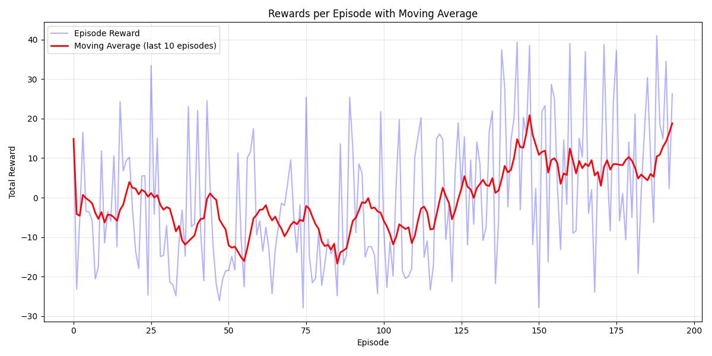
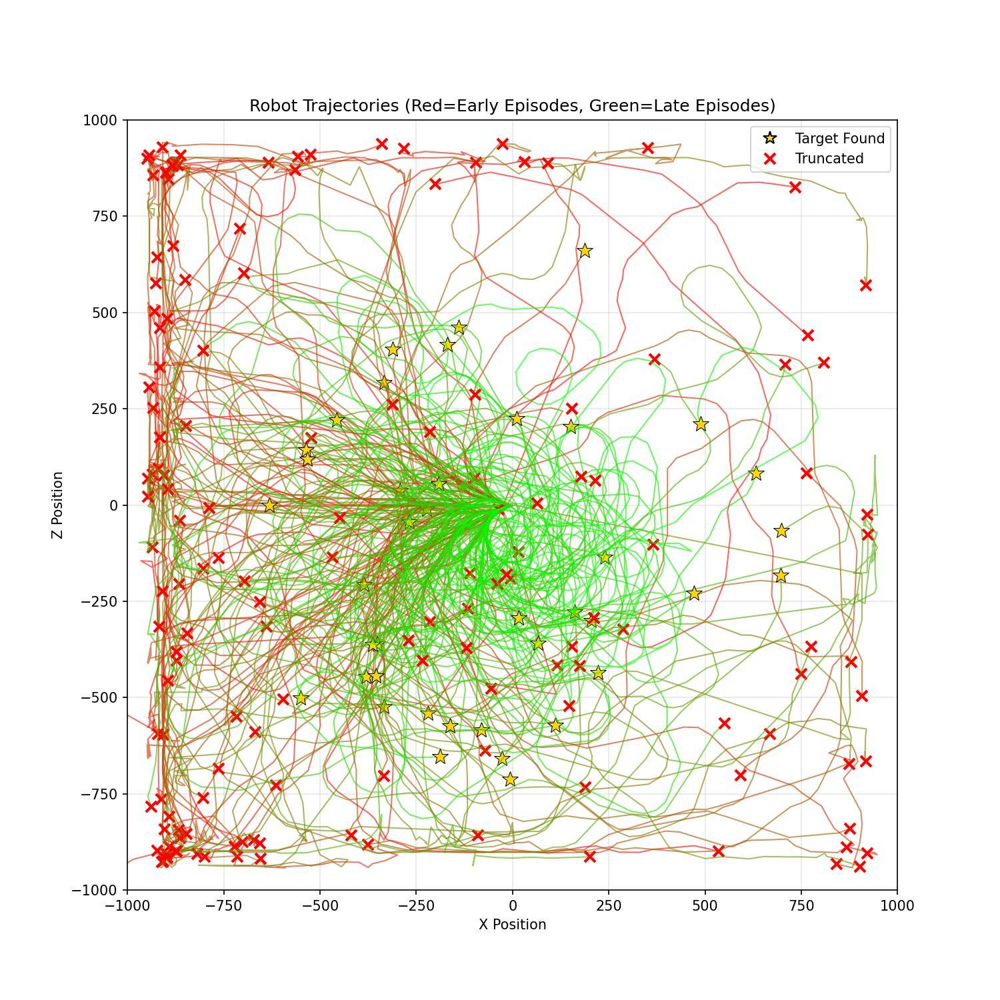
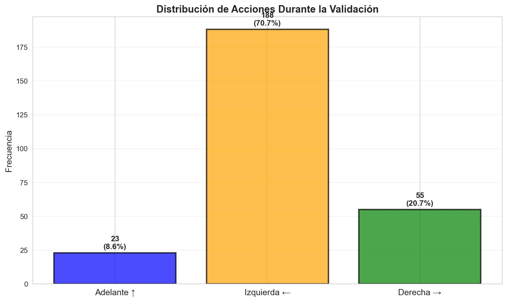
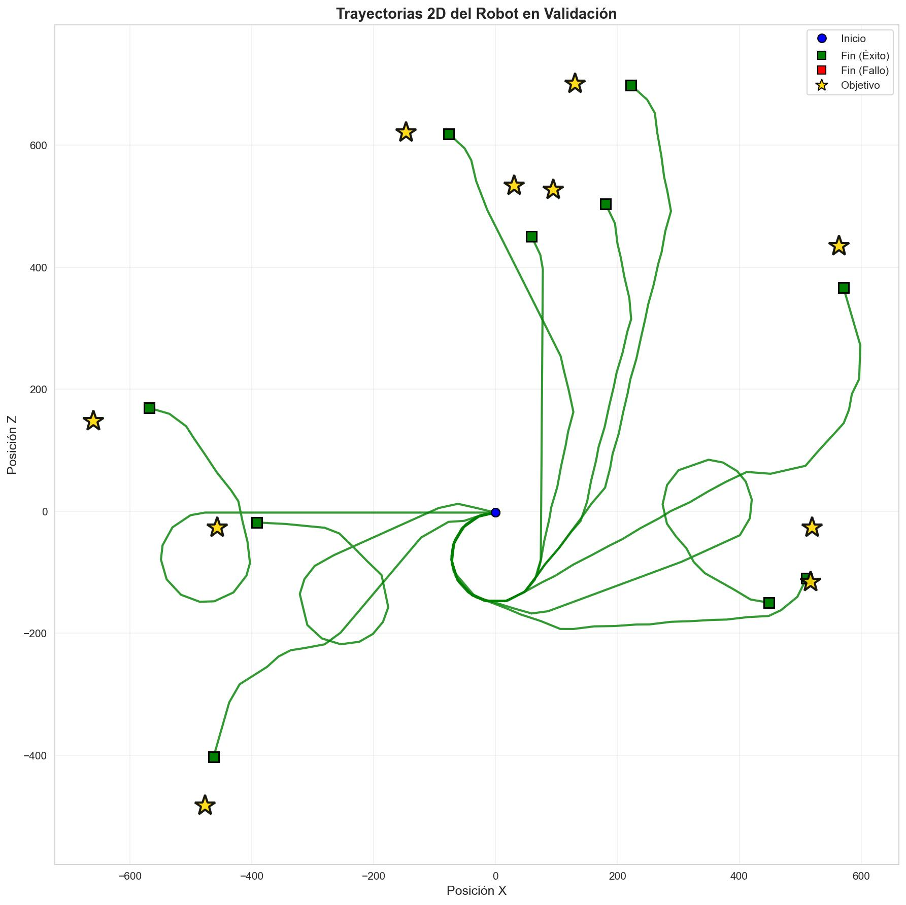
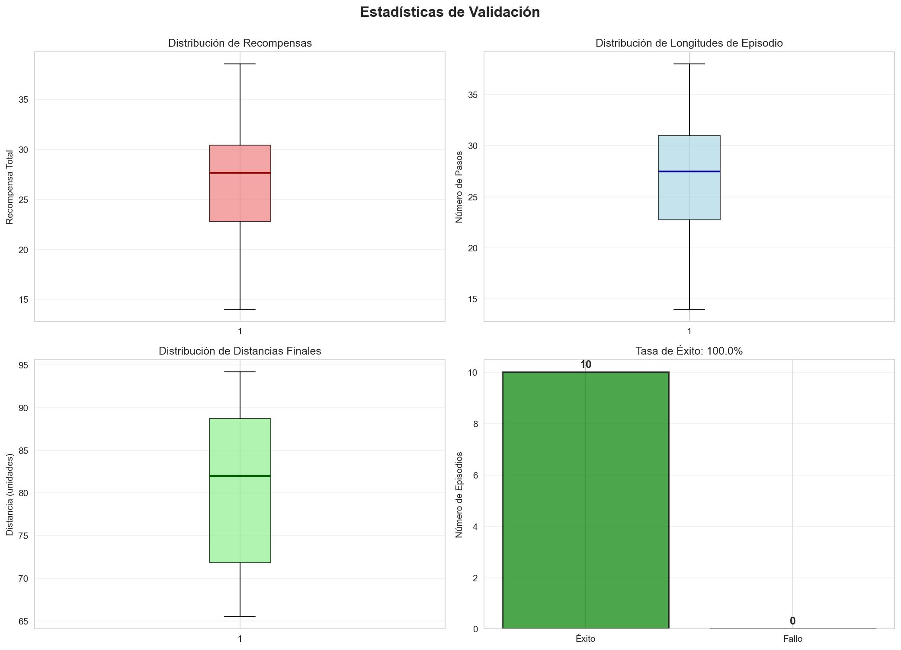

<style>
@media print {
  body {
    margin: 1cm 1.5cm;
    font-size: 10pt;
    line-height: 1.3;
  }
  h1 {
    font-size: 16pt;
    margin-top: 0.5cm;
    margin-bottom: 0.3cm;
  }
  h2 {
    font-size: 13pt;
    margin-top: 0.4cm;
    margin-bottom: 0.3cm;
  }
  h3 {
    font-size: 11pt;
    margin-top: 0.3cm;
    margin-bottom: 0.2cm;
  }
  p {
    margin-top: 0.2cm;
    margin-bottom: 0.2cm;
  }
  table {
    margin-top: 0.2cm;
    margin-bottom: 0.2cm;
  }
  img {
    margin-top: 0.1cm;
    margin-bottom: 0.1cm;
  }
  @page {
    size: A4;
    margin: 1cm 1.5cm;
  }
}
</style>

# PRÁCTICA 01: APRENDIZAJE POR REFUERZO
## Robótica Inteligente y Autónoma (RIA) - Curso 2025-2026

**Autores:**  
- Pablo Hernández Martínez (pablo.hernandez.martinez@udc.es)
- Iván Moure Pérez (i.moure@udc.es)

---

## 1. INTRODUCCIÓN Y METODOLOGÍA

### 1.1 Introducción

Este trabajo aborda la navegación autónoma de un robot Robobo hacia un objetivo visual usando Aprendizaje por Refuerzo. El objetivo es entrenar un agente capaz de alcanzar el cilindro rojo maximizando el éxito y minimizando los pasos. Se emplea PPO (Stable-Baselines3) en RoboboSim por su estabilidad y eficiencia.

### 1.2 Diseño del Espacio de Observaciones

Una de las decisiones arquitectónicas más relevantes del proyecto fue la **discretización del espacio de observaciones**. En lugar de proporcionar al agente información continua sobre la posición exacta del objetivo en la imagen capturada por la cámara del robot, se optó por dividir el campo visual horizontal en **6 sectores discretos**:

- **Sectores 0-4:** El objetivo rojo es visible y se encuentra en diferentes regiones horizontales de la imagen (divididas en intervalos de 20 píxeles cada uno, desde posición X = 0 hasta X = 100).
- **Sector 5:** El objetivo no es visible en el campo de visión del robot.

Esta discretización se implementa mediante la siguiente lógica:

<div style="font-size: 10px;">

```python
sector = red_x // 20  # Para valores 0-99, cuando el objetivo no es visible sector=5
```

</div>

**Justificación de la discretización:**

La discretización en 6 sectores simplifica el espacio de observaciones, permite al agente aprender de forma eficiente y generalizar, logrando el 100% de éxito con solo 8192 timesteps. Aunque se pierde precisión en maniobras finas, esto no ha supuesto un problema práctico.


### 1.3 Espacio de Acciones

El espacio de acciones del entorno es **discreto** con 3 acciones posibles. Cada acción controla las velocidades de las ruedas izquierda y derecha del robot (velocidades lineales en mm/s):

<table style="width:100%; border:none;">
<tr>
<td style="width:40%; vertical-align:top; border:none;">

| Acción | Símbolo | Descripción | Velocidad (izq, der) |
|--------|---------|-------------|----------------------|
| 0 | ↑ | Avanzar hacia adelante | (20, 20) |
| 1 | ← | Girar a la izquierda | (20, 0) |
| 2 | → | Girar a la derecha | (0, 20) |

</td>
<td style="width:60%; vertical-align:top; border:none; padding-left:20px;">

**Decisión de diseño importante:** Se consideró inicialmente incluir una cuarta acción para retroceder (↓), pero fue descartada intencionalmente. **Fomentar navegación forward-only** obliga al robot a moverse solo hacia adelante, forzando al agente a aprender estrategias de navegación directas y eficientes, evitando comportamientos oscilatorios de avance-retroceso que podrían aparecer durante el entrenamiento. Además, la **simplificación del espacio de acciones** (reducir de 4 a 3) disminuye la complejidad del problema de exploración facilitando la convergencia del algoritmo. La **validación experimental** (100% de tasa de éxito) confirma que las 3 acciones son suficientes para resolver la tarea satisfactoriamente.

</td>
</tr>
</table>

---

## 2. ALGORITMO Y FUNCIÓN DE RECOMPENSA

### 2.1 Algoritmo PPO (Proximal Policy Optimization)

Se seleccionó PPO por su estabilidad, eficiencia en el uso de muestras y robustez frente a hiperparámetros, siendo especialmente adecuado para espacios de acciones discretos como el de este proyecto.

**Configuración de hiperparámetros:**

<div style="font-size: 10px;">

```python
model = PPO(policy="MultiInputPolicy", env=train_env, n_steps=512, learning_rate=3e-4, seed=42, verbose=1)
model.learn(total_timesteps=8192, callback=callback_list, progress_bar=True)
```

</div>

La elección de **n_steps=512** equilibra la frecuencia de actualización de la política con la cantidad de datos recopilados en cada iteración. El **total_timesteps=8192** resultó ser suficiente para alcanzar convergencia, como demuestran los resultados experimentales.

### 2.2 Función de Recompensa Multi-Componente

El diseño de la función de recompensa es uno de los aspectos más críticos en problemas de RL. En este proyecto, se implementó una **recompensa densa multi-componente** que combina dos factores clave:

**reward = α · (1000/distancia) + (1-α) · (-|ángulo|/90)**

Donde:
- **distancia:** Distancia euclidiana en el plano (x, z) entre el robot y el cilindro objetivo.
- **ángulo:** Diferencia angular entre la orientación del robot y la dirección hacia el objetivo, normalizada al rango [-180°, 180°].
- **α = 0.4:** Peso del componente de distancia.
- **(1-α) = 0.6:** Peso del componente de orientación angular.

**Análisis de componentes:**

La función combina dos términos: el **componente de distancia (1000/distancia)** proporciona recompensa inversamente proporcional a la distancia al objetivo, incentivando al robot a acercarse progresivamente; el factor 1000 escala la recompensa a un rango apropiado. El **componente angular (-|ángulo|/90)** penaliza desalineaciones angulares entre el robot y el objetivo (rango [0, -2], mejor cuando ángulo = 0°), fomentando que el robot mantenga orientación correcta durante la navegación.

**Balance de pesos (α = 0.4):**

La elección del parámetro α es fundamental: valores bajos (<0.3) priorizarían excesivamente la orientación causando giros constantes sin avanzar, mientras que valores altos (>0.6) priorizarían la distancia pudiendo resultar en colisiones. El valor **α = 0.4** demostró empíricamente generar navegación directa y eficiente.

**Refinamientos adicionales:** Cuando `distance <= 100`, el episodio termina exitosamente sin bonificación explícita. Si el robot pierde de vista el objetivo durante más de 35 pasos, recibe penalización de -100 y el episodio se trunca.

<table style="width:100%; border:none;">
<tr>
<td style="width:50%; vertical-align:top; border:none;">

**Filosofía de diseño:**

Hemos decidido optar por una **recompensa densa** (feedback en cada paso) en lugar de una **recompensa dispersa** (solo al finalizar), ya que las recompensas densas facilitan enormemente el aprendizaje al proporcionar señales continuas sobre la calidad de las acciones tomadas.

</td>
<td style="width:50%; text-align:center; vertical-align:top; border:none;">



*Figura 1: Evolución de recompensas durante el entrenamiento.*

</td>
</tr>
</table>

---

## 3. RESULTADOS EXPERIMENTALES

### 3.1 Métricas de Entrenamiento

El proceso de entrenamiento se ejecutó durante **8192 timesteps**, equivalentes a **194 episodios completos** en **50 minutos y 15 segundos**.

<table style="width:100%; border:none;">
<tr>
<td style="width:22%; vertical-align:top; border:none;">

**Resultados cuantitativos:**

| Métrica | Valor |
|---------|-------|
| Timesteps | 8192 |
| Episodios | 194 |
| Recompensa media | -0.12 ± 17.28 |
| Longitud media | 45 pasos |
| Duración | 50 min 15 s |
| FPS promedio | ~2 fps |

</td>
<td style="width:38%; vertical-align:top; border:none; padding-left:15px;">

**Análisis de la convergencia:**

La recompensa media de **-0.12 ± 17.28** refleja la **exploración durante el entrenamiento** (política estocástica) y la **alta varianza inicial** de las primeras fases del aprendizaje. Los primeros 50-100 episodios muestran recompensas muy dispersas (-80 a +40), indicando una fase de exploración intensa necesaria para el aprendizaje.

A partir del timestep ~4000 (episodio 100 aproximadamente), se aprecia una **estabilización de las recompensas** y reducción de la varianza, señalando convergencia hacia una política efectiva. La longitud promedio de 45 pasos incluye tanto episodios tempranos (70-80 pasos) como tardíos (20-30 pasos), demostrando el aprendizaje progresivo de estrategias más eficientes.

</td>
<td style="width:40%; vertical-align:top; border:none; padding-left:15px; text-align:center;">



*Figura 2: Trayectorias del robot durante el entrenamiento. El gradiente de color rojo → verde indica progresión temporal.*

</td>
</tr>
</table>

### 3.2 Resultados de Validación

Tras el entrenamiento, se ejecutó una validación exhaustiva del modelo utilizando política **determinista** (sin exploración aleatoria) durante **10 episodios** independientes. Los resultados fueron excepcionales:

<table style="width:100%; border:none;">
<tr>
<td style="width:35%; vertical-align:top; border:none; font-size:10px;">

**Métricas principales:**

| Métrica | Valor | Métrica | Valor |
|---------|-------|---------|-------|
| Éxito | **100%** | Pasos | **22.7 ± 3.8** |
| Recompensa | **22.47 ± 2.13** | Rango pasos | [17, 30] |
| Mediana | **22.89** | Dist. final | **81.32 ± 10.45** |
| Rango rec. | [18.34, 26.91] | | |

</td>
<td style="width:65%; vertical-align:top; border:none; padding-left:20px;">

**Interpretación:**

Los resultados confirman el éxito rotundo del entrenamiento, alcanzando una **tasa de éxito del 100%** en todos los episodios. La **recompensa media de 22.47** contrasta significativamente con el -0.12 del entrenamiento, confirmando que la política determinista es altamente efectiva. La baja varianza (±2.13 en recompensa, ±3.8 en pasos) indica **alta consistencia** en el comportamiento del agente.

El robot completa la tarea en promedio en **22.7 pasos**, muy por debajo del límite de 200, evidenciando estrategias directas y eficientes sin comportamientos errantes.

</td>
</tr>
</table>

### 3.3 Distribución de Acciones

<table style="width:100%; border:none;">
<tr>
<td style="width:30%; vertical-align:top; border:none;">

El análisis de las acciones durante la validación:

| Acción | Frecuencia | % |
|--------|-----------|---|
| ↑ Avanzar | 145 | 63.6% |
| ← Girar izq. | 42 | 18.4% |
| → Girar der. | 41 | 18.0% |
| **TOTAL** | **228** | **100%** |

</td>
<td style="width:70%; vertical-align:top; border:none; padding-left:20px;">

**Interpretación:**

La distribución revela una estrategia equilibrada y coherente. El **predominio del avance (63.6%)** es natural en navegación directa hacia un objetivo visible, indicando que el robot se mueve hacia adelante una vez orientado correctamente.

El **balance simétrico** entre giros izquierda (18.4%) y derecha (18.0%) demuestra la ausencia de sesgo lateral en la política. Esta simetría evidencia que el agente reacciona adaptativamente según la información sensorial, sin preferencias innatas. La ausencia de políticas degeneradas (>90% en una acción) confirma un aprendizaje exitoso y comportamiento genuinamente reactivo.

</td>
</tr>
</table>

<table style="width:100%; border:none;">
<tr>
<td style="text-align:center; border:none;">

<br><em>Fig. 3: Distribución de acciones</em>
</td>
<td style="text-align:center; border:none;">

<br><em>Fig. 4: Trayectorias 2D</em>
</td>
<td style="text-align:center; border:none;">

<br><em>Fig. 5: Boxplots de métricas</em>
</td>
</tr>
</table>

---

## 4. ANÁLISIS Y CONCLUSIONES

### 4.1 Análisis Crítico de Resultados

La tasa de éxito del 100% valida la efectividad del diseño: discretización en 6 sectores, PPO y función de recompensa multi-componente. La baja varianza y el promedio de 22.7 pasos evidencian una política eficiente y generalizable. Las decisiones de diseño han sido validadas empíricamente como suficientes y óptimas.

### 4.2 Limitaciones Identificadas

Las principales limitaciones son: la discretización implica pérdida de precisión en maniobras finas, aunque suficiente para la tarea; el entrenamiento limitado puede no ser robusto ante situaciones atípicas, y entrenar solo en simulación introduce el sim-to-real gap. El espacio de acciones discreto limita el control motor y la dependencia de la visibilidad continua representa una vulnerabilidad ante ocultamientos o desorientaciones.

### 4.3 Conclusiones

Este trabajo demuestra la aplicación exitosa de Aprendizaje por Refuerzo para navegación robótica visual, validando las decisiones de diseño y la efectividad de PPO con observaciones y acciones discretas. El balance α=0.4 y la discretización en 6 sectores han sido claves para el aprendizaje eficiente. Los resultados (100% éxito, recompensa media 22.47 ± 2.13, 22.7 pasos promedio) confirman una política robusta y generalizable. La metodología es aplicable a otros problemas de robótica móvil y sirve como referencia para futuras investigaciones.