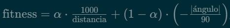
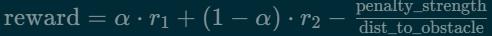
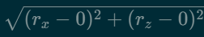

# PRÁCTICA 02: ALGORITMOS EVOLUTIVOS Y REDES NEURONALES

**Robótica Inteligente y Autónoma (RIA) - Curso 2025-2026**

**Autores:** Pablo Hernández Martínez (pablo.hernandez.martinez@udc.es), Iván Moure Pérez (i.moure@udc.es)

---

## PRÁCTICA 2.1: NAVEGACIÓN CON NEAT EN ESCENARIO CILINDRO

### Diseño del Espacio de Estados y Acciones

El espacio de observaciones mantiene la discretización efectiva utilizada anteriormente, dividiendo el campo visual horizontal en 6 sectores: sectores 0-4 cuando el objetivo rojo es visible en intervalos de 20 píxeles (X ∈ [0, 99]), calculado como <code>sector = red_x // 20</code>, y sector 5 cuando no es visible. Esta información se codifica mediante one-hot encoding para la red neuronal, generando un vector de 6 entradas binarias donde solo la posición correspondiente al sector activo vale 1.0. Esta discretización simplifica el espacio de búsqueda del algoritmo evolutivo, facilitando la convergencia sin perder información crítica para la navegación. El espacio de acciones permanece discreto con 3 opciones: acción 0 avanza recto con velocidades (20, 20) mm/s en ambas ruedas, acción 1 gira a la izquierda con (0, 20), y acción 2 gira a la derecha con (20, 0). La salida única de la red neuronal (valor continuo entre 0 y 1) se mapea a estas 3 acciones discretas mediante umbrales: acción 0 si output < 0.33, acción 1 si 0.33 ≤ output < 0.67, y acción 2 si output ≥ 0.67. Esta conversión permite que redes neuronales simples con una sola neurona de salida controlen el comportamiento discreto del robot.

*Figura 2.1.1: Topología ganadora con 6 entradas (sectores visuales) y 1 salida (acción). Red minimalista suficiente para la tarea.*

### Función de Fitness y Configuración NEAT

La función de fitness combina dos componentes: distancia y orientación. La fórmula completa es  donde α = 0.4 balancea ambos términos. El componente de distancia, limitado a un máximo de 5 mediante <code>min(5, 1000/distancia)</code>, incentiva acercarse al cilindro con recompensa inversamente proporcional a la separación. El componente angular penaliza desalineaciones entre la orientación del robot y la dirección hacia el objetivo, con valores en el rango [-2, 0] siendo 0 la orientación perfecta. Adicionalmente, se otorga una bonificación de +90 al alcanzar el objetivo (distancia ≤ 100) y una penalización de -100 si el robot pierde de vista el objetivo durante 35 pasos consecutivos. Este balance con α = 0.4 demostró generar navegación directa y eficiente, evitando tanto giros excesivos (α bajo) como colisiones por priorizar únicamente distancia (α alto).

*Figura 2.1.2: Convergencia rápida en ~10 generaciones hacia fitness óptimo (~90+).*

La configuración NEAT utiliza una población de 10 individuos evaluados durante 10 generaciones máximas. Cada genoma se evalúa en 3 episodios independientes de 50 pasos máximo cada uno, calculando el fitness final como la media aritmética de los tres. La topología inicial es mínima (conexión full entre 6 entradas y 1 salida, sin capas ocultas), permitiendo que el algoritmo añada complejidad solo si es necesario mediante mutaciones: probabilidad 0.5 de añadir/eliminar conexiones y 0.2 de añadir/eliminar nodos. La función de activación es sigmoid en todos los nodos. Los resultados muestran convergencia exitosa en aproximadamente 2-3 minutos (velocidad x4 del simulador), alcanzando fitness de 90+ puntos y tasa de éxito del 100% en validación, confirmando que la representación discretizada y la arquitectura minimalista son suficientes para resolver esta tarea de navegación básica. La topología emergente demuestra que el algoritmo evolutivo descubre representaciones compactas eficientes, con 6-12 nodos totales siendo suficientes frente a arquitecturas densas pre-diseñadas que utilizarían decenas de neuronas por capa.

---

## PRÁCTICA 2.2: NAVEGACIÓN EN POSICIÓN ESPECÍFICA - AVOID THE BLOCK

### Ampliación del Espacio de Observaciones con Sensores IR

Al introducir el escenario "Avoid the block" con posición inicial fija (x=-1000.0, y=39.0, z=-400.0), se hace necesario incorporar información de proximidad a obstáculos. El espacio de observaciones se amplía de 6 a 10 entradas neuronales, manteniendo las 6 correspondientes a los sectores visuales (codificación one-hot idéntica a 2.1) y añadiendo 4 nuevas entradas para el sensor IR frontal-central. Este sensor se discretiza en 4 estados mediante one-hot encoding: estado 0 para distancias lejanas (IR < 5), estado 1 para medio-lejos (5 ≤ IR < 20), estado 2 para medio-cerca (20 ≤ IR < 50), y estado 3 para muy cerca (IR ≥ 50). La implementación concatena ambos vectores one-hot en un único array de entrada <code>nn_input = [0.0] * 10</code>.

*Figura 2.2.1: Convergencia en ~25 generaciones con mayor variabilidad inicial por la presencia del obstáculo.*

*Figura 2.2.2: Red ganadora con 10 entradas integrando información visual e IR. Topología más densa que 2.1.*

La justificación de esta ampliación sensorial radica en que la posición específica coloca al robot en una configuración donde el camino directo hacia el cilindro puede estar obstruido. La información IR permite al agente detectar la proximidad del obstáculo sólido central y tomar decisiones de evasión antes de colisionar. Sin estos sensores, el robot navegaría exclusivamente con información visual del objetivo, careciendo de consciencia espacial sobre elementos bloqueantes en su trayectoria. La discretización en 4 estados (en lugar de binario cerca/lejos) proporciona granularidad suficiente para distinguir diferentes regímenes de proximidad, permitiendo comportamientos graduales: mantener velocidad en estado 0, reducir velocidad en estados 1-2, y realizar maniobras evasivas en estado 3.

### Ajuste de Fitness y Resultados

El parámetro α de la función de fitness se reduce de 0.4 a 0.35, incrementando el peso del componente angular de (1-α)=0.6 a 0.65. Esta modificación prioriza la orientación correcta sobre la minimización agresiva de distancia, evitando comportamientos de "ataque directo" que causarían colisiones con el obstáculo. La configuración NEAT aumenta las generaciones máximas de 10 a 25 para compensar el espacio de búsqueda más amplio (10 inputs vs 6), pero reduce los episodios de evaluación por genoma de 3 a 1, aprovechando que la posición inicial fija elimina variabilidad aleatoria y hace cada evaluación más determinista. El entrenamiento converge exitosamente mostrando mayor variabilidad en las primeras generaciones mientras explora estrategias de evasión, estabilizándose hacia la generación 15-20 con fitness comparables a 2.1 (~90+ al alcanzar objetivo). La red ganadora desarrolla conexiones más complejas que en 2.1, evidenciando la integración de múltiples fuentes sensoriales para navegación reactiva en entornos con obstáculos.

---

## PRÁCTICA 2.3: NAVEGACIÓN COMPLETA CON EVASIÓN DE OBSTÁCULOS

### Maximización de Información Sensorial

Esta subpráctica representa el mayor desafío al eliminar la restricción de posición inicial fija, requiriendo que el robot alcance el cilindro desde cualquier punto del escenario evitando el obstáculo central. El espacio de observaciones se expande a 14 entradas neuronales: 6 para sectores visuales (one-hot), 4 para el IR frontal-central (one-hot idéntico a 2.2), y 4 nuevas entradas binarias para sensores IR adicionales. Estos sensores laterales y traseros codifican: IR derecho (FrontRR) y IR izquierdo (FrontLL) con umbral 25 (0=lejos si ≥25, 1=cerca si <25), e IR trasero-derecho (BackR) e IR trasero-izquierdo (BackL) con umbral 2 (0=libre si ≥2, 1=bloqueado si <2). Esta percepción omnidireccional es crítica porque la posición inicial variable puede colocar al robot orientado en cualquier dirección, incluso de espaldas al objetivo, necesitando consciencia espacial completa para ejecutar maniobras de reorientación sin colisionar durante giros.

*Figura 2.3.1: Red con 14 entradas, topología más densa reflejando la complejidad del problema.*

La codificación binaria (no one-hot) de los 4 IR adicionales se justifica porque estos sensores cumplen función de "señal de alarma" (obstáculo detectado/no detectado) más que proporcionar información de distancia gradual como el IR frontal-central. Esta decisión reduce el espacio de búsqueda de 6+4+4×4=26 entradas (si todos fueran one-hot) a 14, manteniendo información suficiente: los IR laterales previenen colisiones durante giros, y los traseros evitan que el robot retroceda inadvertidamente hacia obstáculos al ejecutar maniobras de corrección.

### Función de Fitness con Penalización Espacial

El avance clave de esta subpráctica es la introducción de un término de penalización geométrica en la función de fitness. La fórmula completa se convierte en:  donde <code>penalty_strength = 500</code> activa la penalización espacial hacia la zona prohibida centrada en (x=0, z=0), ubicación del obstáculo sólido. La distancia a esta zona se calcula como distancia euclidiana  y la penalización es inversamente proporcional, creciendo hiperbolicamente al acercarse. Por ejemplo, a 100 unidades del obstáculo la penalización es 500/100=5 puntos, pero a 20 unidades escala a 500/20=25 puntos, dominando sobre las recompensas base (~1-5 puntos). Este gradiente suave guía al algoritmo evolutivo hacia soluciones que mantienen distancia de seguridad, descartando automáticamente genomas que intentan atravesar (0,0) porque reciben fitness negativos.

*Figura 2.3.2: Curva de aprendizaje extendida mostrando meseta inicial (~20 gen.) mientras se aprende evasión básica, seguida de optimización de trayectoria.*

La efectividad de la penalización inversamente proporcional frente a alternativas (penalización binaria dentro/fuera de radio, penalización lineal) radica en que genera un "campo repulsivo" continuo sin discontinuidades. Las penalizaciones binarias crean saltos abruptos en fitness que dificultan la exploración gradual de NEAT, mientras que la penalización lineal no escala suficientemente rápido en proximidad extrema. El valor <code>penalty_strength=500</code> se calibró empíricamente: valores menores (100-200) permitían acercamientos excesivos con colisiones ocasionales, valores mayores (>1000) generaban comportamientos ultra-conservadores que evitaban incluso pasar cerca del obstáculo, alargando innecesariamente las trayectorias. Con 500, el robot desarrolla rutas perimetrales eficientes, rodeando el obstáculo con margen de seguridad (~150-200 unidades) sin desviaciones exageradas.

### Configuración, Estrategias Emergentes y Resultados

La configuración NEAT escala a 100 generaciones máximas, reflejando la complejidad del espacio de búsqueda con 14 inputs. Se mantiene población de 10 individuos y se incrementan los episodios de evaluación a 2 (equilibrio entre variabilidad y coste computacional). Las primeras 20 generaciones muestran fitness bajos (~-50 a 10) mientras la población explora el espacio, frecuentemente colisionando o quedando atrapada. Entre generaciones 20-50 emerge la capacidad básica de evasión, con fitness estabilizándose en 30-60 puntos. La fase final (50-100) optimiza trayectorias, reduciendo pasos necesarios y mejorando alineación angular, alcanzando fitness de 90+ en individuos ganadores.

El análisis de las soluciones evolucionadas muestra que el comportamiento exitoso se compone de dos fases secuenciales, no excluyentes: primero, los individuos aprenden a rodear el obstáculo central desplazándose en diagonal o por el perímetro del escenario, evitando la penalización fuerte del centro. Una vez que el robot consigue línea de visión directa al cilindro, la red aprende a acercarse de forma eficiente para maximizar la recompensa, afinando la orientación y minimizando la distancia. Este proceso de aprendizaje por fases se refleja claramente en la gráfica de fitness, donde se aprecia una transición marcada: al principio, la población solo logra evitar el obstáculo, y posteriormente, tras varias generaciones, los individuos empiezan a alcanzar el objetivo de manera consistente, incrementando notablemente el fitness medio y máximo. Así, la solución final integra ambas partes como pasos sucesivos de una misma estrategia robusta.

La progresión de las tres subprácticas evidencia escalabilidad sistemática del enfoque: la complejidad del espacio de entradas crece 6→10→14, requiriendo generaciones 10→25→100 (factor ~2.5× por cada +40% de inputs). El parámetro α decrece de 0.40 (2.1) a 0.35 (2.2 y 2.3), reflejando que en entornos con obstáculos la orientación correcta es más valiosa que minimizar distancia agresivamente. La introducción de penalización espacial en 2.3 constituye el avance arquitectónico clave, transformando un problema de optimización con restricciones implícitas (no colisionar) en uno con restricciones explícitas en el paisaje de fitness. La lección fundamental es que la discretización del espacio de observaciones (sectores visuales + IR categorizados) actúa como *inductive bias* apropiado para navegación robótica: el robot no necesita saber la posición exacta en píxel del objetivo (información continua de alta dimensionalidad), sino solo en qué región general está (información categórica de baja dimensionalidad), siendo esta última suficiente para acciones discretas de control. Esta simplificación, combinada con funciones de fitness multi-componente que balancean objetivos en conflicto (distancia vs orientación vs evasión), y penalizaciones geométricas que moldean el paisaje de búsqueda, forma una metodología transferible a problemas similares de navegación autónoma con restricciones espaciales.

